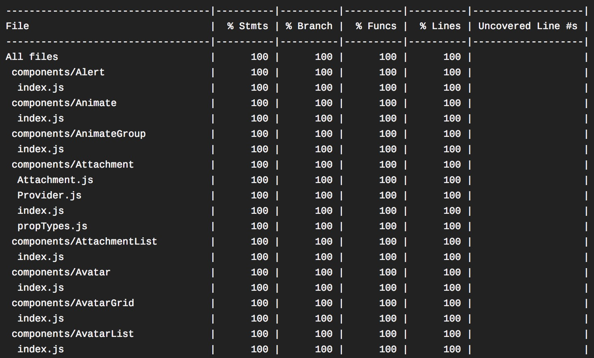

# Writing tests

In this guide, we'll walk through writing test for our [custom `Strong` component.](creating.md) in [Storybook](https://storybook.js.org/).

Blue uses [Jest](https://jestjs.io/) and [Enzyme](https://github.com/airbnb/enzyme) for testing.

## Directory

All of Blue's component test files are scoped in the same directory as the component, example:

```
blue/
  └── components/
      └── Button/
          └── __tests__/
              └── Button.test.js
```

## Initial files

The first thing we'll need to do is create a dedicated `__tests__` directory under `Strong/`:

```
blue/
  └── components/
      └── Strong/
          └── __tests__/
```

Under `__tests__/`, we'll need to create the main `Strong.test.js` file:

```
blue/
  └── components/
      └── Strong/
          └── __tests__/
              └── Strong.test.js
```

## Base test code

In our `__tests__/Strong.test.js` file, we'll need to add:

```jsx
import React from 'react'
import { mount } from 'enzyme'
import Strong from '../Strong'

describe('classNames', () => {
  test('Has default className', () => {
    const wrapper = mount(<Strong />)
    const el = wrapper.find('Strong')

    expect(el.hasClass('c-Strong')).toBe(true)
  })
})
```

#### `mount`

Blue favours [mount rendering vs. shallow rendering](https://blog.kentcdodds.com/why-i-never-use-shallow-rendering-c08851a68bb7) for testing. The benefits are many. The only downside is `mount` is slightly slower compared to `shallow`.

## Test development

For test development, open up your terminal and run the following command:

```
npm run dev
```

This fires up Jest in watch mode, and runs tests against modified files (and their associated files).

## Code coverage



To check code coverage, run the following command:

```
npm run test
```

This runs through the entire Jest test suite, and generates a [coverage report](https://istanbul.js.org/) under:

```
blue/
  └── coverage/
      └── lcov-report/
          └── index.html
```

You can open the `index.html` in your browser to view the full report.

Since Aug 31, 2017, Blue has maintained [**100% code coverage**](https://coveralls.io/github/helpscout/blue?branch=master) for tests. Because Blue is a component library (rather than an App), it's testing coverage is stricter. Everything must be tested. There are no exceptions... Except...

## Exceptions

...the strange or untestable cases within the [JSDOM](https://github.com/jsdom/jsdom) environment (which Jest runs on). (lol). Many DOM APIs are **not supported** in JSDOM (e.g. height/width calculations, scrolling, positioning, etc...).

For anything that Jest/JSDOM cannot catch, use [`istanbul ignore`](https://github.com/gotwarlost/istanbul/blob/master/ignoring-code-for-coverage.md) to skip coverage checking.

Fabulous 🤩! `Strong` is now super reliable, thanks to tests!

## Next

Let's [write some documentation](documentation.md) to make sure other folks know how to use `Strong`.

## See also

* [Jest](https://jestjs.io/)
* [Enzyme](https://github.com/airbnb/enzyme)
* [Istanbul](https://istanbul.js.org/)
* [Coveralls](https://coveralls.io/)
